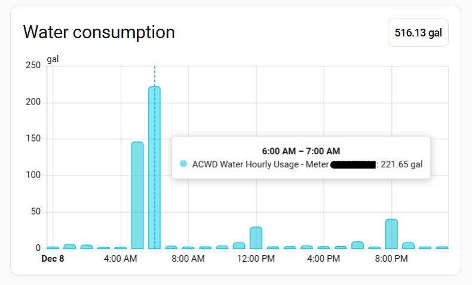

# ACWD Water Usage Integration for Home Assistant

A **HACS-compatible custom integration** that brings your ACWD (Alameda County Water District) water usage data directly into Home Assistant, with full support for the **Home Assistant Energy Dashboard**. ACWD services the cities of Fremont, Newark, and Union City, CA.

## Background

After ACWD deployed [AMI (Advanced Metering Infrastructure) smart meters](https://en.wikipedia.org/wiki/Smart_meter#Advanced_metering_infrastructure), third-party solutions like Flume Water lost direct access to real-time water usage data. This integration bridges that gap by importing hourly water usage directly from the ACWD portal into Home Assistant.

**What you get:**

- ✅ Hourly water usage data in the Energy Dashboard
- ✅ Regular updates throughout the day (ACWD updates in batches 4x daily)
- ✅ Historical statistics and long-term tracking
- ⚠️ Not real-time like Flume (data reflects ACWD portal batch update schedule)

## Quick Start

1. **Install via HACS** (see [INSTALLATION.md](INSTALLATION.md) for detailed instructions)
2. **Add Integration** in Settings → Devices & Services
3. **Enter your ACWD portal credentials** (stored securely in Home Assistant's encrypted credential storage)
4. **Add to Energy Dashboard** - Use the "ACWD Water Hourly Usage - Meter xxxxxxxxx" statistic

## Available Entities

| Entity | Description | Unit |
|--------|-------------|------|
| Current Cycle Usage | Water used in current billing cycle | Gallons |
| Current Cycle Projected | Projected total for current billing cycle | Gallons |
| Last Billing Cycle | Previous billing cycle usage | Gallons |
| Average Usage | Historical average per billing cycle | Gallons |
| Highest Usage Ever | Peak usage record | Gallons |

The integration updates **every hour** and automatically imports **hourly water usage data**, providing water usage breakdown in the Energy Dashboard.

## Installation

See [INSTALLATION.md](INSTALLATION.md) for complete setup instructions including:

- HACS installation (recommended)
- Manual installation
- Energy Dashboard configuration
- Hourly data import (automatic & manual)
- Troubleshooting

## Key Features

- **Automatic Batch Import**: Integration polls hourly and imports data as ACWD releases it in 4 daily batches (7-8 AM, 12-1 PM, 5-6 PM, 8-9 PM)
- **Yesterday's Data by Morning**: Complete 24-hour usage for yesterday typically available by 8 AM daily (based on ACWD's batch schedule)
- **Automatic Initial Import**: On first installation, imports yesterday's complete hourly data for immediate feedback
- **Manual Import Services**: Import historical data for any date range via Home Assistant services
- **Energy Dashboard Integration**: Full compatibility with Home Assistant's Energy Dashboard
- **Long-term Statistics**: Data stored in HA's statistics database for historical analysis
- **15-Minute Interval Support**: Optional 15-minute data available via manual service (note: Energy Dashboard displays hourly granularity; 15-min data useful for custom cards, automations, and advanced analysis)
- **Smart Duplicate Handling**: Statistics system automatically handles re-imports by replacing existing timestamps

## Data Availability

⚠️ **ACWD updates water usage data in batches throughout the day**, not continuously:

**ACWD Portal Update Schedule:**

ACWD releases data in 4 batches per day (times are consistent within 1-hour windows):

- **7:00-8:00 AM** - Yesterday's final 3 hours (9 PM - midnight) + Today's first 8 hours (midnight - 7 AM)
- **12:00-1:00 PM** - Today's next 5 hours (8 AM - 12 PM)
- **5:00-6:00 PM** - Today's next 5 hours (1 PM - 5 PM)
- **8:00-9:00 PM** - Today's next 3 hours (6 PM - 8 PM)

**What this means:**

- Each day's data arrives in 4 batches totaling 21 hours (midnight - 8 PM)
- The final 3 hours (9 PM - midnight) appear the next morning at 7-8 AM
- Yesterday's complete 24-hour usage typically available by 8 AM daily (based on ACWD's schedule)
- The integration checks hourly and automatically imports new data as ACWD releases it
- Example: At 3 PM Tuesday, you'll see Monday's complete 24 hours + Tuesday's first 13 hours (midnight - noon)

## Contributing

Found a bug or want to add a feature? Pull requests welcome!

## Disclaimer

This is an unofficial tool and is not affiliated with or endorsed by ACWD. Use at your own risk.
