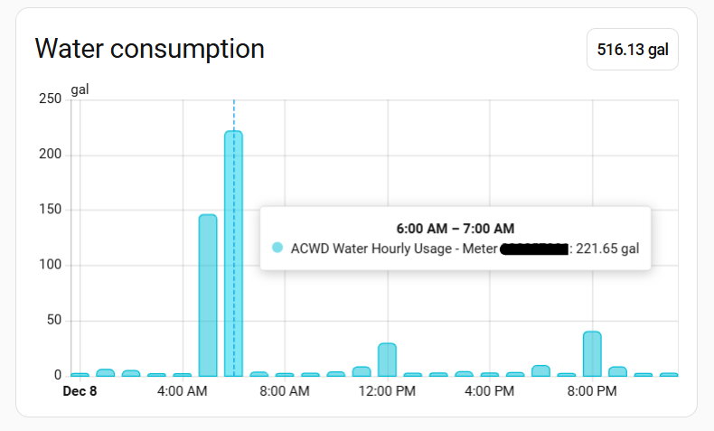

[![Build][build-badge]][build-link]
[![Codecov][coverage-badge]][coverage-link]
[![Release][release-badge]][release-link]
[![HACS][hacs-badge]][hacs-link]
[![Home Assistant][ha-badge]][ha-link]

# ha-acwd

ACWD Water Usage Integration for Home Assistant

**ha-acwd** imports your Alameda County Water District (ACWD) water usage into Home Assistant, including hourly usage for the Energy Dashboard. Install it from HACS.

## Background

After ACWD deployed [AMI (Advanced Metering Infrastructure) smart meters](https://en.wikipedia.org/wiki/Smart_meter#Advanced_metering_infrastructure), third-party solutions like Flume Water lost direct access to real-time water usage data. This integration imports hourly water usage directly from the ACWD portal instead.

**What you get:**

- Hourly water usage data in the Energy Dashboard
- Regular updates throughout the day (ACWD updates in batches 4x daily)
- Historical statistics and long-term tracking
- Usage arrives in ACWD's daily batches, so it runs a few hours behind rather than live like Flume

## Quick Start

1. **Install via HACS** (see [INSTALLATION.md](INSTALLATION.md) for detailed instructions)
2. **Add Integration** in Settings → Devices & Services
3. **Enter your ACWD portal credentials** (saved in Home Assistant's integration settings)
4. **Add to Energy Dashboard** - Use the "ACWD Water Hourly Usage - Meter xxxxxxxxx" statistic

## Available Entities

| Entity | Description | Unit |
| ------ | ----------- | ---- |
| Current Cycle Usage | Water used in current billing cycle | Gallons |
| Current Cycle Projected | Projected total for current billing cycle | Gallons |
| Last Billing Cycle | Previous billing cycle usage | Gallons |
| Average Usage | Historical average per billing cycle | Gallons |
| Highest Usage Ever | Peak usage record | Gallons |

The integration updates every hour and imports hourly water usage for the Energy Dashboard.

## Installation

See [INSTALLATION.md](INSTALLATION.md) for complete setup instructions including:

- HACS installation (recommended)
- Manual installation
- Energy Dashboard configuration
- Hourly data import (automatic & manual)
- Troubleshooting

## Key Features

- On first setup, imports yesterday's complete hourly data
- Import historical data for any date range with Home Assistant services
- Stores usage in Home Assistant's long-term statistics
- Optional 15-minute data through the manual import service (the Energy Dashboard still shows hourly totals; 15-minute data is for custom cards and automations)
- Re-importing a date replaces the existing hours instead of duplicating them

## Data Availability

ACWD releases usage data in 4 batches per day, each within a 1-hour window:

- **7:00-8:00 AM** - Yesterday's final 3 hours (9 PM - midnight) + Today's first 8 hours (midnight - 7 AM)
- **12:00-1:00 PM** - Today's next 5 hours (8 AM - 12 PM)
- **5:00-6:00 PM** - Today's next 5 hours (1 PM - 5 PM)
- **8:00-9:00 PM** - Today's next 3 hours (6 PM - 8 PM)
- Each day's data arrives in 4 batches totaling 21 hours (midnight - 8 PM)
- The final 3 hours (9 PM - midnight) appear the next morning at 7-8 AM
- Yesterday's complete 24-hour usage is typically available by 8 AM
- The integration checks hourly and automatically imports new data as ACWD releases it
- Example: At 3 PM Tuesday, you'll see Monday's complete 24 hours + Tuesday's first 13 hours (midnight - noon)

## Contributing

Bug reports and pull requests are welcome. See [CONTRIBUTING.md](CONTRIBUTING.md) for development setup and guidelines.

## Disclaimer

This is an unofficial tool and is not affiliated with or endorsed by ACWD. Use at your own risk.

[build-badge]: https://github.com/funkadelic/ha-acwd/actions/workflows/tests.yml/badge.svg
[coverage-badge]: https://img.shields.io/codecov/c/github/funkadelic/ha-acwd?logo=codecov
[release-badge]: https://img.shields.io/github/v/release/funkadelic/ha-acwd
[hacs-badge]: https://img.shields.io/badge/HACS-Default-orange
[ha-badge]: https://img.shields.io/badge/Home%20Assistant-2025.4+-blue

[build-link]: https://github.com/funkadelic/ha-acwd/actions/workflows/tests.yml
[coverage-link]: https://codecov.io/gh/funkadelic/ha-acwd
[release-link]: https://github.com/funkadelic/ha-acwd/releases
[hacs-link]: https://hacs.xyz
[ha-link]: https://www.home-assistant.io
